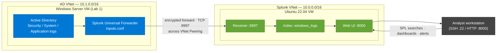
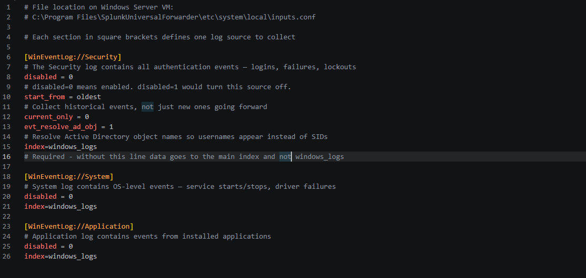
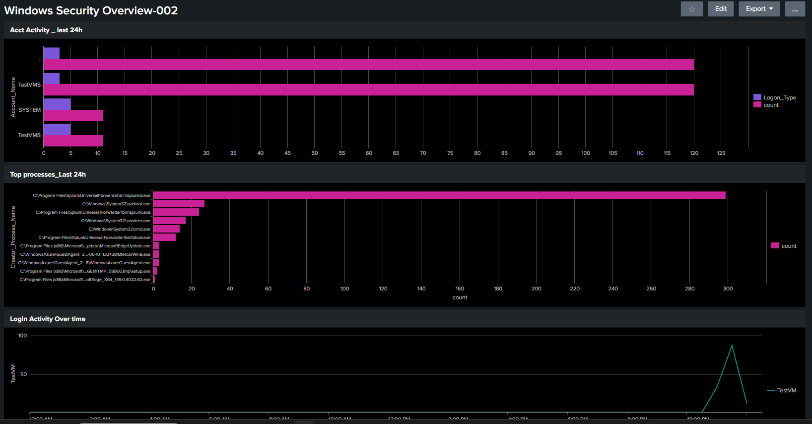

# Splunk SIEM & Log Analysis

> Deploying Splunk Enterprise on an Azure VM, forwarding Windows Security logs from an Active Directory host, and building SOC-grade searches, dashboards, and alerts.


---

## Overview

This lab stands up a working Security Information and Event Management (SIEM) pipeline. A Windows Server VM running Active Directory forwards its Windows Event Logs to a separate Ubuntu VM running Splunk Enterprise. Splunk indexes those events and makes them searchable, allowing the kind of authentication-failure investigation, threat hunting, and alerting a SOC analyst performs daily.

Everything here runs on the Splunk Free licence (500 MB/day indexing) and Azure free-tier-eligible resources, so the total cost is **$0**.

> **🎥 [Watch the video walkthrough on Loom](https://www.loom.com/share/a2fd07d34e8c48b5adeaa58f2342a7ad)** — a narrated tour of the deployment, searches, dashboard, and alert.

| Field | Value |
| --- | --- |
| Certification alignment | CompTIA Security+ · CySA+ · Splunk Core Certified User |
| Tooling | Splunk Enterprise (free licence) · Splunk Universal Forwarder |
| Environment | Azure — Ubuntu 22.04 VM + Windows Server VM (from Lab 1) |
| Time to complete | 4–6 hours across multiple sessions |
| Estimated cost | $0 |
| Career relevance | SOC Analyst (Tier 1–3) · Security Engineer · Incident Responder |

---

## Architecture

The Windows Server VM and the Splunk indexer live in **two separate Azure Virtual Networks**. To let them communicate, the VNets are joined with **VNet Peering**, and an NSG rule permits forwarder traffic on TCP 9997. The Windows Server forwards Security, System, and Application logs across the peering to the Splunk indexer, which stores them in a dedicated index and exposes them through the web UI for search, dashboards, and alerting.



> **VNet Peering was the key networking step.** The two VMs sit in separate Virtual Networks, so even with correct NSG port rules they cannot reach each other by default. Peering the VNets — plus the inbound 9997 rule on the Splunk NSG — is what allows the forwarder to deliver logs to the indexer.

**Network exposure (Azure NSG rules):**

| Port | Purpose | Source (this lab) | Recommended for production |
| --- | --- | --- | --- |
| 8000 | Splunk web UI | Any | Trusted admin IP only |
| 22 | SSH to Ubuntu VM | Any | Trusted admin IP only |
| 9997 | Universal Forwarder input | Peered VNet (`10.1.0.0/16`) | Peered VNet only |

> For speed in this short-lived lab, management ports were left open to `Any`. In a real deployment these would be scoped to a trusted admin IP (or fronted by a bastion/Just-in-Time access). Port 9997 is only reachable across the VNet peering — it is **not** exposed to the public internet.

---

## The Problem This Lab Solves

A mid-sized organisation generates millions of log events per day across workstations, Active Directory, firewalls, web servers, and cloud resources. Without a SIEM, those logs sit in isolated systems — no one can search across them, correlate events, or spot the patterns that indicate an attack.

A SIEM is the SOC's primary tool. When an alert fires, the analyst opens the SIEM to understand what happened, when, from where, and what was affected. Splunk is the most widely deployed commercial SIEM, which makes hands-on Splunk experience directly relevant to nearly every security operations role.

| Role | How this lab applies |
| --- | --- |
| SOC Analyst (Tier 1) | Monitoring dashboards, searching logs for suspicious activity, escalating findings |
| SOC Analyst (Tier 2–3) | Building detection rules, correlating events across sources, threat hunting |
| Cloud Security Engineer | Microsoft Sentinel and AWS Security Hub reuse the same SIEM mental model |
| Incident Responder | Building event timelines and identifying scope of compromise during an incident |

---

## Key Concepts

<details>
<summary><strong>What is a SIEM?</strong></summary>

Security Information and Event Management. A platform that collects log data from across an environment and makes it searchable in one place. Its two core jobs are **correlation** (connecting events across systems to reveal patterns no single system would show) and **alerting** (automatically notifying analysts when suspicious conditions are met).
</details>

<details>
<summary><strong>What is SPL (Splunk Processing Language)?</strong></summary>

The query language used to ask Splunk questions. It works as a pipeline: start with a search, then pipe results through commands that filter, transform, and visualise. Example: `index=windows_logs EventCode=4625 | stats count by Account_Name | sort -count` finds failed logins, counts them by username, and sorts highest first. Every search follows the same pattern — find the events, then shape the results.
</details>

<details>
<summary><strong>What is a Splunk index?</strong></summary>

A named storage bucket for events, similar to a database table. Searches specify which index to query with `index=name`. Separate indexes for different data sources allow independent control of retention, permissions, and storage. This lab uses one index: `windows_logs`.
</details>

<details>
<summary><strong>What is the Universal Forwarder?</strong></summary>

A lightweight, free Splunk agent installed on any machine whose logs you want to collect. It monitors log files and Windows Event Logs, compresses and encrypts the data, and forwards it to the indexer over port 9997 using minimal CPU and RAM.
</details>

<details>
<summary><strong>Key Windows Event IDs</strong></summary>

| Event ID | Meaning | Security signal |
| --- | --- | --- |
| 4624 | Successful logon | Baseline of normal activity |
| 4625 | Failed logon | Spike on one account = brute force; spread across many = password spray |
| 4740 | Account lockout | Trail of lockouts can indicate an attack in progress |
</details>

<details>
<summary><strong>What is inputs.conf?</strong></summary>

The configuration file that tells the Universal Forwarder which data to collect. It lives on the forwarder host. Each `[bracketed]` section defines one data source; settings beneath it control behaviour (`disabled=0` = enabled, `start_from=oldest` = collect history). Edit once, restart the forwarder once.
</details>

---

## What I Built

| Skill demonstrated | Real-world application |
| --- | --- |
| Deployed Splunk + configured a data input | Every Splunk deployment begins with getting data in via the Universal Forwarder |
| Navigated the Splunk interface | Search, dashboards, alerts, reports — table stakes for any SOC role |
| Wrote SPL searches | The skill that separates analysts who find threats from those who only watch dashboards |
| Built a security dashboard | Login failures over time, top sources, failed auth by user — security posture at a glance |
| Identified failed login attempts | Distinguishing normal user error from a brute force attack |
| Built an automated alert | Splunk fires on defined conditions instead of waiting for a human to notice |
| Wrote an account-lockout detection (4740) | A lockout trail can reveal a password spray in progress (detection ready; no lockouts generated in this run) |

---

## Build Walkthrough

### Step 1 — Deploy Splunk on an Azure VM

Splunk Enterprise is a free download (60-day full trial, then automatically converts to the free 500 MB/day licence). Choose **Splunk Enterprise for Linux** — not Splunk Cloud or SOAR.

**VM specification:**

| Setting | Value |
| --- | --- |
| OS | Ubuntu 22.04 LTS (free-tier eligible) |
| Size | Standard_B2s (2 vCPU, 4 GB RAM — Splunk requires ≥ 4 GB) |
| Disk | 30 GB minimum |
| Inbound NSG ports | 8000, 9997, 22 (scoped as in the table above) |

**Install (run over SSH on the Ubuntu VM):**

```bash
# Download Splunk Enterprise (version current as of the build date).
# If this URL 404s, grab the current .deb wget command from splunk.com → Free Trials and Downloads.
wget -O splunk.deb "https://download.splunk.com/products/splunk/releases/10.2.2/linux/splunk-10.2.2-80b90d638de6-linux-amd64.deb"

# Install the package
sudo dpkg -i splunk.deb

# Start Splunk and accept the licence (prompts for admin credentials)
sudo /opt/splunk/bin/splunk start --accept-license

# Enable Splunk to start automatically on reboot
sudo /opt/splunk/bin/splunk enable boot-start

# Web UI is now reachable at:  http://<YOUR_VM_PUBLIC_IP>:8000
```

> **Connecting via SSH:** macOS/Linux use the built-in `ssh user@PUBLIC_IP`. Windows users can use PuTTY (port 22, SSH). Note: when typing a password in PuTTY, nothing appears on screen — that's normal Linux behaviour.

---

### Step 2 — Configure Data Inputs

**Part A — Enable receiving in Splunk:**

1. Log into the web UI → **Settings → Forwarding and Receiving**
2. **Configure Receiving → New Receiving Port →** enter `9997` → **Save**
3. **Settings → Indexes → New Index →** name it `windows_logs` → **Save**

**Part B — Install the Universal Forwarder on the Windows Server VM** (the AD host from Lab 1 — *not* the Splunk VM):

1. Download the Windows 64-bit Universal Forwarder from splunk.com
2. During install, set the **Receiving Indexer** to the Splunk VM's **private IP : 9997**
3. Complete with default settings

**Part C — Configure `inputs.conf`** at
`C:\Program Files\SplunkUniversalForwarder\etc\system\local\inputs.conf`
(create the `local` folder if it doesn't exist; edit with Notepad as Administrator):

```ini
[WinEventLog://Security]
# Authentication events — logins, failures, lockouts
disabled = 0
start_from = oldest
current_only = 0
evt_resolve_ad_obj = 1   # Resolve AD names so usernames appear instead of SIDs
index = windows_logs     # REQUIRED — without this, data lands in main, not windows_logs

[WinEventLog://System]
# OS-level events — service starts/stops, driver failures
disabled = 0
index = windows_logs

[WinEventLog://Application]
# Events from installed applications
disabled = 0
index = windows_logs
```

> **Easy-to-miss detail:** the `index = windows_logs` line must appear under *every* stanza. Without it, the forwarder routes events to the default `main` index and your `index=windows_logs` searches return nothing — a classic first-time-setup gotcha.



Then restart the forwarder (PowerShell as Administrator):

```powershell
Restart-Service SplunkForwarder
```

**Part D — Connect the two VNets (VNet Peering + NSG rule):**

The Windows Server and Splunk VMs are in **separate Azure Virtual Networks**, so they cannot communicate by default — even with the right port rules. Two things are required:

1. On the **Splunk VM's NSG**, add an inbound rule allowing **TCP 9997** from the AD VNet range (the forwarder's source).
2. Create a **VNet Peering** between the two networks: **Virtual Networks → (Splunk VNet) → Peerings → Add**, select the AD VNet as the remote network, and let Azure provision both directions. Wait for **Status: Connected** on both sides.

After the networking is in place, restart the forwarder once more so it re-attempts the connection:

```powershell
Restart-Service SplunkForwarder
```

> **No Lab 1 AD VM yet?** Splunk ships with sample data. Go to **Search → Data Summary** to find sample indexes and complete most of the search exercises while you build out Lab 1.

---

### Step 3 — Essential SPL Searches

**Confirm data is flowing:**

```spl
index=windows_logs | head 100
```
If this returns results, the forwarder is working. If empty, verify the `SplunkForwarder` service is running on the Windows VM.

**Failed logins (brute-force indicator):**

```spl
index=windows_logs sourcetype=WinEventLog:Security EventCode=4625
| stats count by Account_Name, Workstation_Name
| sort -count
```
A count of 5+ for one account in a short window is a possible brute-force attempt.

**Successful logins by logon type:**

```spl
index=windows_logs sourcetype=WinEventLog:Security EventCode=4624
| stats count by Account_Name, Logon_Type
| sort -count
```
Logon types: `2` interactive · `3` network · `5` service account · `10` RDP.

**Account lockout events:**

```spl
index=windows_logs sourcetype=WinEventLog:Security EventCode=4740
| table _time, Account_Name, Caller_Computer_Name
| sort -_time
```
Multiple lockouts for one account = likely brute force or password spray. *In this lab run the simulated activity produced no 4740 events, so this search returns empty — it's included as a ready-to-use detection that populates the moment real lockouts occur.*

**Top 10 failed-login usernames (threat hunting):**

```spl
index=windows_logs sourcetype=WinEventLog:Security EventCode=4625 earliest=-24h
| stats count as failures by Account_Name
| sort -failures
| head 10
```
20+ failures in 24h warrants investigation. Usernames that don't exist in AD suggest account enumeration.

**After-hours logins:**

```spl
index=windows_logs sourcetype=WinEventLog:Security EventCode=4624
| eval hour=strftime(_time, "%H")
| where hour < 7 OR hour > 19
| table _time, Account_Name, Workstation_Name, Logon_Type
| sort -_time
```
After-hours service logins (Type 5) are expected; after-hours interactive logins (Type 2/10) from regular users warrant review.

---

### Step 4 — Build a Security Dashboard

I built a dashboard named **Windows Security Overview** (**Dashboards → Create New Dashboard**) to surface security posture at a glance without re-running searches manually.



| Panel | What it shows | Visualisation |
| --- | --- | --- |
| Acct Activity — Last 24h | Logon activity broken down by `Account_Name` and `Logon_Type` | Bar chart |
| Top Processes — Last 24h | Most frequent process-creation events by `Creator_Process_Name` | Bar chart |
| Login Activity Over Time | Logon volume over the day via `timechart count` | Line chart |

> The Top Processes panel is a useful addition beyond authentication monitoring — surfacing the most-spawned executables helps spot anomalous process activity (e.g., unexpected `cmd.exe` or script-host spikes) during threat hunting.

---

### Step 5 — Create an Automated Alert

Alerts automate detection: instead of watching dashboards, Splunk runs a search on a schedule and notifies you when conditions are met — the way real SOC detection works.

I created a scheduled alert named **High Privileged Logon Count** that fires when results are returned, with the **Add to Triggered Alerts** action.


| Setting | Value |
| --- | --- |
| Name | High Privileged Logon Count |
| Status | Enabled |
| App | search |
| Alert type | Scheduled (cron schedule) |
| Trigger condition | Number of Results > 0 |
| Trigger action | Add to Triggered Alerts |

For reference, a brute-force-style threshold alert built the same way looks like this:

```spl
index=windows_logs sourcetype=WinEventLog:Security EventCode=4625
| stats count as failures by Account_Name
| where failures > 10
```

> **Tuning note:** Alert quality determines monitoring quality. Too broad → alert fatigue; too narrow → missed threats. Thresholds are a starting point you'd tune against observed false positives in a real environment.

---

## Verification

| Check | How to verify |
| --- | --- |
| Data flowing into Splunk | `index=windows_logs \| head 10` returns recent events |
| Failed-login search works | Run the `EventCode=4625` search; if empty, mistype a password on the Windows VM a few times and re-run |
| Dashboard displays data | **Windows Security Overview** shows populated panels |
| Alert is active | **Settings → Searches, Reports, and Alerts** lists **High Privileged Logon Count** as Enabled |

---

## Skills Summary

This lab demonstrates end-to-end SIEM capability: deploying the platform, instrumenting a Windows endpoint with the Universal Forwarder, writing investigative SPL, visualising security posture in a dashboard, and operationalising detection through a scheduled alert. These are the exact workflows a Tier 1–3 SOC analyst, security engineer, or incident responder performs on the job.

---

## Legal & Ethical Notice

This lab was performed entirely within a self-owned, isolated Azure lab environment using accounts and systems I control. The detection techniques shown are for defensive security monitoring and education. Do not run authentication-failure or enumeration tests against systems you do not own or lack explicit written authorisation to test.
